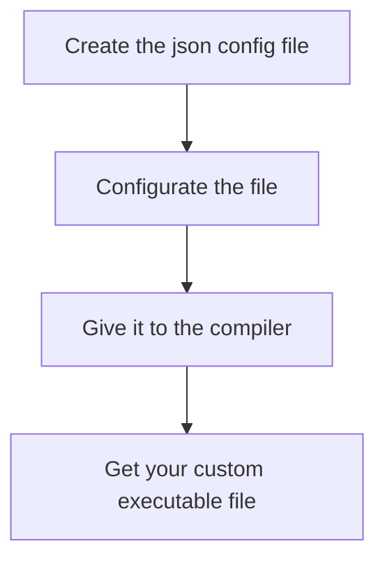

# MementoMori

### A Go interpretation of DIY malware configurable with json

![](data:image/png;base64,iVBORw0KGgoAAAANSUhEUgAAAOEAAADhCAMAAAAJbSJIAAAAh1BMVEX///8AAADr6+vu7u6NjY3IyMjw8PBFRUXY2Njp6eny8vKCgoL6+vrm5ub09PT7+/t4eHjS0tLg4OCqqqqenp62trY7OzsbGxsPDw+rq6uGhoa8vLwsLCxZWVkVFRUiIiJiYmI0NDRtbW1OTk5cXFzCwsInJydBQUGgoKCUlJRqampzc3NLS0uznV+aAAAMEElEQVR4nO2d6XriOgyGgUDKUijL0IWuKUP3+7++MylICWB9sR07Ns/h/TcLwSKyJMuy3GqdOXPmzJkzZ86cORMrV6EHYIXBqC+T0+RSX8TOaWLwvi9Dj9UKg1fYak1Cj9aCiYmArVYSerzGJGYCtq7Kn02SzoAYE/kffv/NO539b6aR/I6rwNj+k54mvVW3212NiCmR/yH/J/+s9r+ZRvL7Tz0ScmgqYOtq99Fkdt2Ol+sZDdNYwMKepvc3oeUQublPd6M0sqME29NRaEFERjREQztK0EwchxZEZEyz0E7Akp6GlkSgno7mDHcPGMSpp6OBtR0lCnuahZZGQdan4dVYCpGeDmPU0/thXR3NoYdMXkPLc8TrpLaO5sSrp9nMgY7msD1d3oaWaY/bZW07SrA9/Q4t1B7f9e0oQ35/HlqoPeY1fX0Ztqd3oaUqcefEjhL0sHE8evo9dqejrWIxnPQeQku246HnyI4Seno66rnk/h18lVsdzSHDPHyEP+zQWd4iTbrgm/6SgKkrAUt6+gy++Mddgi7tPcnf88yZC4epefb7CyBhu+ssQTdAv+TCma8vw/b0BXz128aRiFBHX9zaUYa+u49eIn95PdJ79Ar7Dn19GQ7kP5CIq6E0agOS/gX4ig9e7jiWkO3pHOlpu5dK49ZnMkVqMt/9L3d2lCBjk2yQCj3Oa0/FtAee/8xT3amZ2UJ6OvmDXuJIGrguSR9loP/wKNwLWGzWJGiaPN3X1FOY9brgMfgQsHCKG/QSs3oSwszl7caLKyzgzRqop9M6AuLs8x96hV50NGf3CyZzFJ/eLOsYG2RH2Yy5t6PE1S51AM1d+8fenqZLEI+yKxp4LBVhS4bCqvaXrd/HGb2uVztKsJ6ukYi29nTyBR7agI7msN+H6vTTt9JTmFl/Wnr09WU4PoV6+m0TgiczlCXpeotHD6FfcpAhEe8spiLMdGWUH/Xj68sUSXAk4dPYWE9xFshdirsazlVAPX0ZCIJI4Ixzl/6bdx3NIXva/wFDul0YvsQx2t1i0+XXjhKX5PfhpmJmZk/TO7TzQ+5n0ICO5rDnRSFWe23iFJPeG3jUtBFfX4YyzjDdUOTENBj+BQ+66NcoC7KD/f4Cqdb1TFtEaEeLKd2QjuaQ1qSwSINzKlVgHR3RD9WYjubQ0OYoadP+1PT7YxSPPtctC7KDN2tgErytZ09xhnLhfBtGD9JTXEy01gltkhl6BJcFNaqjLe3izE8dHUUZ2GtXJRfmcHwKw8nnanuaQB29azAePYRXM8hMtLMqAdMNWml+uSkLskOzmOizYiYmKLoNqKM5esnFtw3UU5xB958+xJCeJrBIY41cRgJLrL/ty9QdQcOEm4rtEdj9hplXb1uF+rAZgKoGttwmn+hzfxpLzcjoFRNdS3qKM8uOy4LsYHuKi4lW6pQGzro6LwuygxcZUE9v1fY0wToaZElxDA8DJsFvVfEpzoKs+ccLK2CpmAgt8dRbwxn4wIOPsiA72BVAlXtaHukpzppzyB5YR3No6ANYpMHxF09CuPPB6dbQOvoLDRku84rS+t3/htnW9iy4ry+jt1lTHI/YKh/MRDa3DaOHVtFb+6Gsp9iO+ipds0avmKi85YaLZryWBdnB66gVkrC85Qb/YzfwmkkFDwmfqKV9apyhu+YfLLRYJYpiInii9nWrp8kcpcpvfJcF2cGuAOvpditjCFciKza3oYXaR6uYaFuijbMeDZVcmEPxKV7ytR/TqswVL5eDx6OHsN+Hrry9mFzCVcg0Ml9fRq+Y6K0HI/R1rDqaUxQTQXu6RtmAm6bKguxge4r1FMGVmxHqaA4X8MLFMOCNrExMvr6MXjGRjMOTr77gE7V2ejp1ePLVF1rFRBINlwXZUUtP49fRHNLTIVwMK3kZxq+jOVxMhM6AqnhvvizIDr1iomNu76L29WV4HQ83v4/46pyGjubQSxybvMTbMGVBdmgWE+0TqizIDk4u6uvpV2zpwwqMO73V6roWAr2T32UdPQlfX4YGnMLFMMPVxDGHawew39fppJGdiq8vwx1eYc3altuPzqnpaA7p3RgmF395HJ+ejuaQ9a9ug8bpw9BDNmQ3s3CC+Bde94Yeshk7r4/rSXbzkEpIT8Tbb9ml3fQWws+kp5Em2FRcUvCt13ZpfTILJ4byLbotM6lTwsk4RJqEGs5wy809bZ2GHroepKMGLZZ5u+I09JQGiw5rHTI6JT2lnCmuqj2EThieQGBDOoor+Y54n52KnlJNLa4eUkCnf8LWy2pA8Yl5b2Wq6o5cTymYgS1sBGiZGHVoc0UBt97ifp8vCsEj1lOehHa7a3ToPuKpuJtJtr1cnzexrzI44EbVv4gs9rzwbnhjk2BmH65UCC2KGspGmAUze3ATmij1lCLLmW0lRs57xC6DE4iZpjBvyr2px3jT35TV1cjMbFmrN24owx/dKoODGVjqXeanr6wOy2ZxZm3IUeBeIHtczHtKPf0b5WqYgpmJQVPzi75QUEx92aIKbSgWkTPcx6/rop/O1QUbs/hWw+woxOzh+jgUv+gnqfogUXwugxyF3OrpqXdcBpb31Zmo9ZR7YcQyFUlH5S3fxfzYAuUSJn31MiuyrA05Cvns2qijsLG/vZHSjToCmsekp+Qo5mLA/c+mSBJ2UnWEwGekYtBTikHkYGaTqvwk9bfKlJ9ZxKOnlD+St5n++TcgYTpTRkE3vVhWw2xH1a+incco6liHe5SpX/5PLBtSu2EMxfNOv4cJkYTJWG1PuWdEWAFpEsqO4vfQIXyHQk9IPnsRdCpyMCNuM20rf6GEUuOQdQShDR3nmogp/N3dYVhC6TYCbpcYLgTfDUDeCr3ZVadXSJgKOrAMXYhCOio3NqHTkhUSSjV+XLMYSE/ZUYh1pG8D0CWzLKFU4zcNGtrQqhc4Ci53qpQw6WfKR5DLCLIaprBKPjT6pyRAhYRibf8snMvggFus63osmtJUSyg1DnkZh8ra0CSUD3GVu+5oSJgM1LsdfLS7aRFJR+VtpkWp04eGhNIC+ibQapgcxUA8ETstd7/SkVBqGMaXnjTqMqjhtdx1Z713yYWWhFKy9ZsmRJN6SmP7EM/F7Heh05JQWmM+0ZGoBhP91dnDg8u79CTsDNWxw3XjITifTxNP4H0d3P6gKWEyV589XTe9IUXjETMzRSsyMwnF9liLZkNwyswIicB8QIdj15VQOsufNZq1oUkon2b+OmrnqS9hqp7ajw0mUGkSys26VBNMX0LhduwV/Wr+pyKtKMS6ruK8q42EnY5QEddram+YVjNyk5muotW8gYRSKM8uw/NU5FWvuBX6rhy2wTuUlmMNbUjR7ygG3OpWpSYSipWbS9IfnwJyVwhJwPaHuheriYTiHk8D3Xm4cE0MuF/VV1kZSSj27nv1nrXhrsFyXZdwbZ6ZhOJ9wFxr4ytrQ0tRuR5hqbCjFhJ2Jup11NPG72qYr7QQU/gj6RorUwmlwqML/gl8CEgpfLlN6bs8swwlFC8E43tdPOgpT0L56in5LgtzCYXsAZdnepiK5IzktixduX++uYRSz94fb6ENB9xiCv8vuPvIXMLOUFh9Tn2F4LvHym0S4P1VFhKK9Ud3flbD5Ih6mSThHRDQSkJpSyub+dBT0gy5rusF3kRiI6HYq59rbRy6DG45IzqKijuArSQUTzB+uj+0QBGvuM30fD9MEOqaqBR+JkmGUnnAzPVqmDIz8jbTV6+C5fFYr5dVH+r1VmrfyxtSjvSUt5nMT9z5wu2GFAUzUo4oBHzVgpPQhp7V0a7Cb4CHxN1qmFcUZv3XfPNKelp7Ktr20PONu6s7OTOThZbpgMxRCM4t7vVPijQF9wuppafcl6zGiTtvfLjYc+OaGb02LM3y0KufteFVr83RbP+sa09FXvXGE8zsM6q7GqZJiC8DCEnNPmHROooCdhlWU5FXvfZN5P0zrbEa5vSoZfuAhljaJ1DJ1eMbOMNjfZMnBzPLVbdgNSLKf6tD8cn6T9gb0dIytOGz5/9kLNEZEPt/X0mn+GT9J3T2/poxchlXVUmiGDFaDVdeph0lBi7jsvppUaKtp6cqoL6IEyMTEBPa9jSmo/4mnOq4z5w5c+bMmTNnzvwP+A/EPvNLwKp7owAAAABJRU5ErkJggg==)

## Modules dependancies

Run this commands
```bash
go get github.com/redcode-labs/Neurax

go get github.com/redcode-labs/Coldfire
```

## How it works?



## What can I customize in my config file?

You can customize your malware with your config.json file. 
You can : 

* Change the name of the executable
* Specify the OS
* Specify the environnement
* Implement the behavior of the malware
* Set the protection against reverse analysis
* Add some extra comment in specific language

This is the values you can change or set :

| Value | Description | Necessary? | Format | Possible values | example |
|-------|-------------|------------|--------|-----------------|---------|
| name | Name of the executable file | ✅ | string | . | "name": "script", |
| os | To specify the OS | ❌ | string | <ul><li>windows</li><li>linux</li><li>android</li></ul> | "os": "linux",|
| env | Environnement value | ❌ | string | . | "env": "amd64",|
| stage | Produce a stager for your malware | ✅ | boolean | true, false | "stage": false,|
| behavior | Set up the behavior of the malware | ✅ | string | <ul><li>revershell</li><li>zombi</li><li>ransomware</li></ul> | "behavior": "revershell",|
| extra | More details about the behavior, see the specific section bellow for more details | ✅ | | | |
| protection | Level of protection of the malware against reverse analysis | ❌ | int | <ul><li>0</li><li>1</li><li>2</li><li>3</li></ul> | "protection": 1, |
| comment | Add comment in specifique language to bamboozle to analyser | ✅ | string | <ul><li>none</li><li>eng</li><li>ru</li><li>cn</li><li>fr</li><li>it</li></ul> | "comment": "none", |