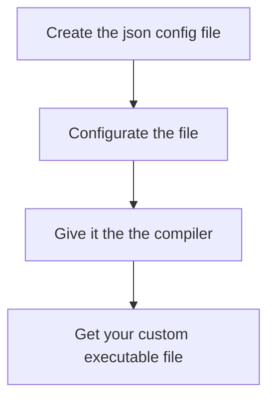

# Go Inferno

### A Go interpretation of DIY malware configurable with json

## Modules dependancies

Run this commands
```bash
go get github.com/redcode-labs/Neurax

go get github.com/redcode-labs/Coldfire
```

## How it works?



## What can I customize in my config file?

You can customize your malware with your config.json file. 
You can : 

* Change the name of the executable
* Specify the OS
* Specify the environnement
* Implement the behavior of the malware
* Set the protection against reverse analysis
* Add some extra comment in specific language

This is the values you can change or set :

| Value | Description | Necessary? | Format | Possible values | example |
|-------|-------------|------------|--------|-----------------|---------|
| Name | Name of the executable file | ✅ | string | . | "Name": "script", |
| OS | To specify the OS | ❌ | string | <ul><li>windows</li><li>linux</li><li>android</li></ul> | "OS": "linux",|
| Env | Environnement value | ❌ | string | . | "Env": "amd64",|
| Behavior | Set up the behavior of the malware | ✅ | string | <ul><li>revershell</li><li>zombi</li><li>ransomware</li></ul> | "Behavior": "revershell",|
| Extra | More details about the behavior, see the specific section bellow for more details | ✅ |  |  |  |
| Protection | Level of protection of the malware against reverse analysis | ❌ | int | <ul><li>1</li><li>2</li><li>3</li></ul> | "Protection": 1, |
| Comment | Add comment in specifique language to bamboozle to analyser | ✅ | string | <ul><li>none</li><li>eng</li><li>ru</li><li>cn</li><li>fr</li><li>it</li></ul> | "Comment": "none", |